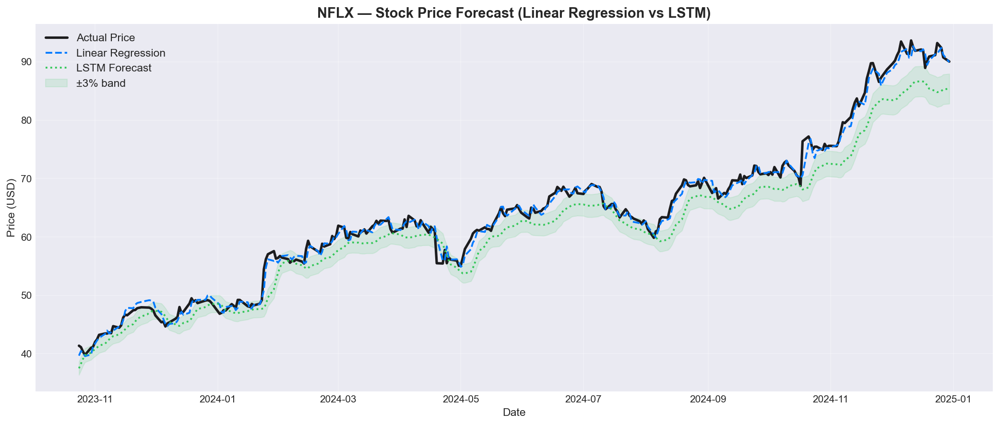
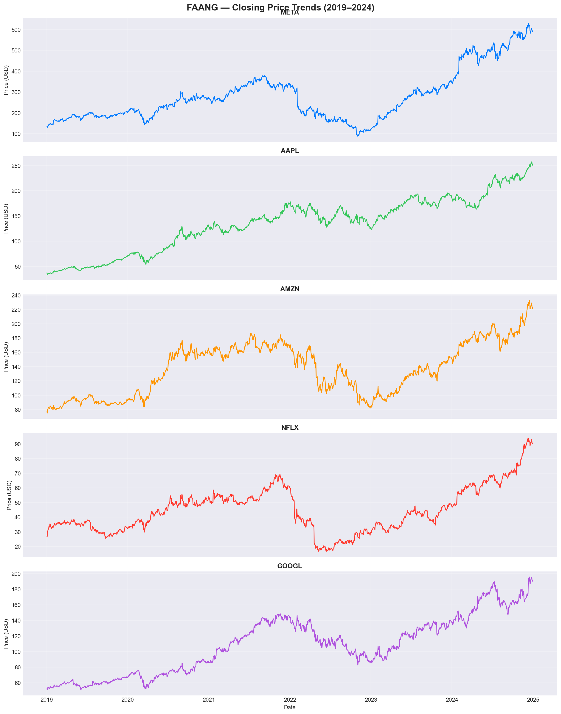
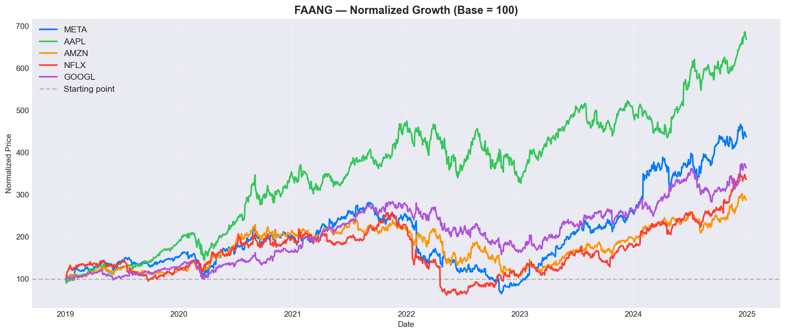
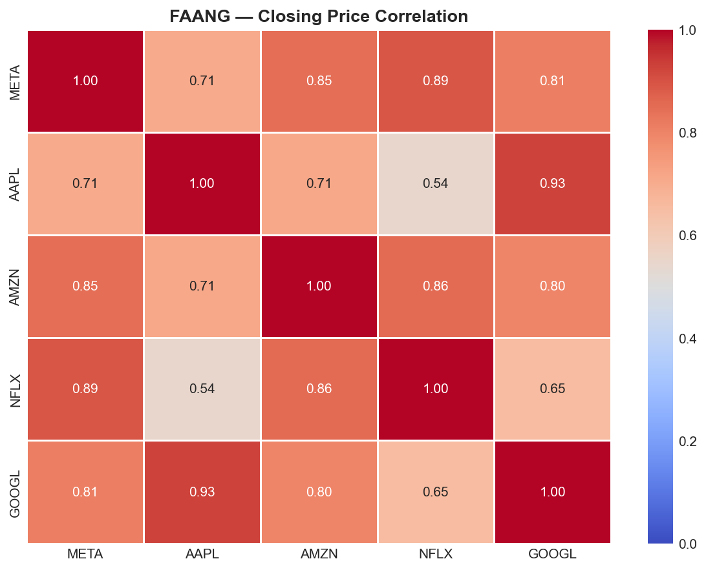
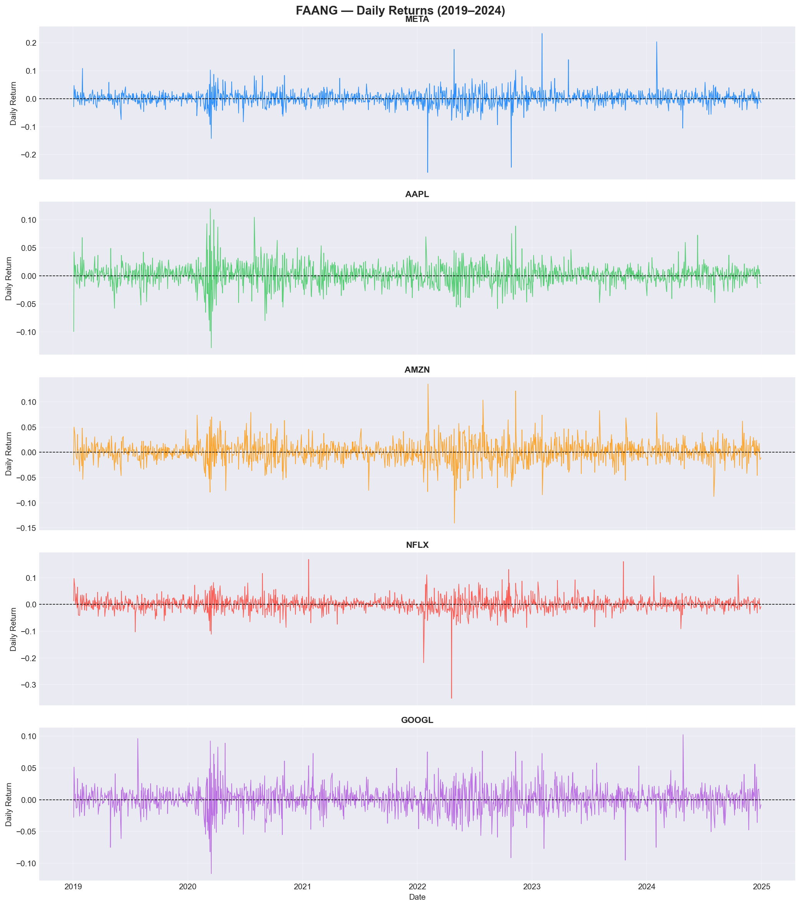
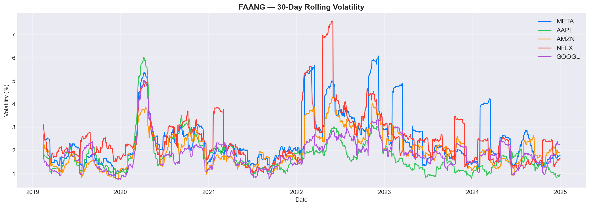
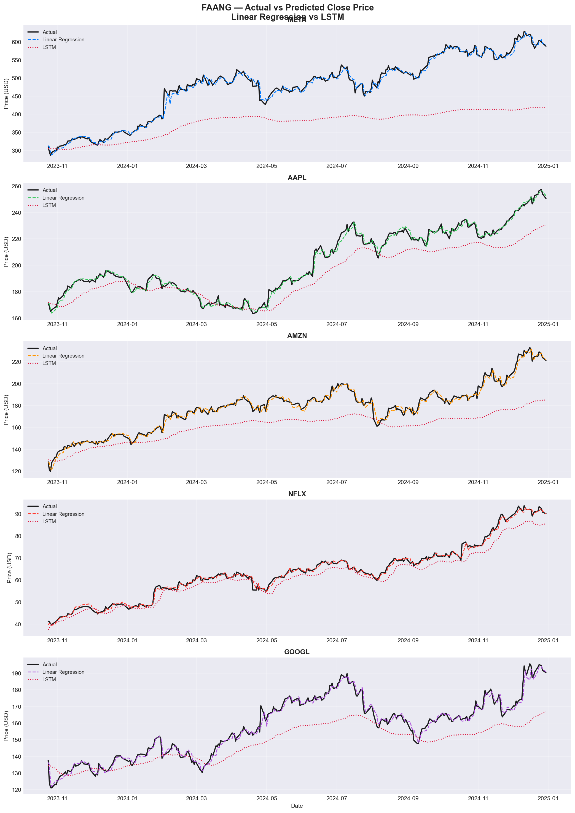

<div align="center">

# 📈 FAANG Stock Price Forecasting

### Predicting tomorrow's stock prices using Machine Learning & Deep Learning




</div>

---

## 📌 Table of Contents

- [About the Project](#-about-the-project)
- [What This Project Does](#-what-this-project-does)
- [Repository Structure](#️-repository-structure)
- [Project Workflow](#️-project-workflow)
- [Feature Engineering Explained](#-feature-engineering-explained)
- [Models Used](#-models-used)
- [Results & Visualizations](#-results--visualizations)
- [Model Performance](#-model-performance)
- [Tech Stack](#️-tech-stack)
- [How to Run This Project](#-how-to-run-this-project)
- [Key Learnings](#-key-learnings)
- [Future Improvements](#-future-improvements)
- [Author](#-author)

---

## 🧭 About the Project

Stock prices are notoriously hard to predict — but they follow patterns that machine learning can partially learn from historical data. This project builds a **complete, end-to-end forecasting pipeline** for five of the world's biggest tech companies, popularly known as **FAANG**:

> **F**acebook (Meta) · **A**pple · **A**mazon · **N**etflix · **G**oogle

Using **6 years of daily stock data (2019–2024)**, the project walks through every stage of a real-world data science workflow — from collecting raw data to training and comparing two very different forecasting models.

> 💡 **In simple terms:** this project tries to answer *"based on a stock's past behavior, can we predict its next closing price?"* — and compares a simple, classic approach against a more advanced AI approach to see which one performs better.

---

## 🎯 What This Project Does

✅ Collects 6 years of historical stock data for 5 major companies
✅ Explores the data visually — trends, returns, risk, and correlations
✅ Creates "smart" features that summarize a stock's recent behavior
✅ Trains **two different models** to predict future prices
✅ Evaluates which model predicts more accurately — and why

This mirrors a real industry workflow: **Data Collection → EDA → Feature Engineering → Modeling → Evaluation**, which is exactly the structure recruiters and hiring managers look for in a data science portfolio project.

---

## 🗂️ Repository Structure

```
faang-stock-forecasting/
│
├── data/
│   ├── raw/                    # Raw daily stock data (Open, High, Low, Close, Volume)
│   └── processed/              # Cleaned data with engineered features, split into train/test
│
├── images/                     # All charts generated by the notebooks
│   ├── 01_closing_prices.png
│   ├── 02_normalized_growth.png
│   ├── 03_correlation_heatmap.png
│   ├── 04_daily_returns.png
│   ├── 05_volatility.png
│   ├── 06_actual_vs_predicted.png
│   └── 07_hero_chart.png
│
├── notebooks/                  # The full pipeline, step by step
│   ├── 01_data_collection.ipynb
│   ├── 02_eda.ipynb
│   ├── 03_preprocessing.ipynb
│   ├── 04_modeling.ipynb
│   └── 05_evaluation_and_viz.ipynb
│
├── LICENSE
└── README.md
```

---

## ⚙️ Project Workflow

The project is organized into 5 clear, numbered notebooks — run them in order to reproduce the entire pipeline from scratch.

| Step | Notebook | What Happens Here |
|:---:|---|---|
| 1️⃣ | `01_data_collection.ipynb` | Downloads 6 years (2019–2024) of daily stock data for META, AAPL, AMZN, NFLX & GOOGL |
| 2️⃣ | `02_eda.ipynb` | Visually explores price trends, growth, risk (volatility), and how the 5 stocks relate to each other |
| 3️⃣ | `03_preprocessing.ipynb` | Creates new "features" from raw prices and splits data into training & testing sets by date |
| 4️⃣ | `04_modeling.ipynb` | Trains a **Linear Regression** model and an **LSTM neural network** for each stock |
| 5️⃣ | `05_evaluation_and_viz.ipynb` | Measures how accurate each model was and visualizes predictions vs. real prices |

---

## 🧪 Feature Engineering Explained

Raw stock data only gives you the price for a single day — not much to learn from on its own. So before modeling, each stock's data is enriched with **technical indicators** commonly used by real traders and analysts:

| Feature | Plain-English Meaning |
|---|---|
| `MA7`, `MA21` | The average closing price over the last 7 and 21 days — smooths out daily noise to show the underlying trend |
| `Daily_Return` | How much the price went up or down (%) compared to the previous day |
| `Volatility` | How "shaky" or risky the stock has been recently (based on the last 21 days) |
| `RSI` | A 0–100 score showing if a stock has been overbought or oversold recently (momentum indicator) |
| `Lag_1`, `Lag_2`, `Lag_3` | The closing prices from 1, 2, and 3 days ago — helps the model learn from recent history |

📅 **Train/Test Split:** The data is split by **time**, not randomly (80% earlier data for training, 20% later data for testing). This avoids "cheating" by letting the model see the future — a common beginner mistake in time series projects.

---

## 🤖 Models Used

Two very different modeling philosophies were compared head-to-head:

| Model | Category | How It Works |
|---|---|---|
| 🟦 **Linear Regression** | Classic Machine Learning | A simple, fast baseline model that finds a straight-line relationship between the engineered features and the closing price |
| 🟥 **LSTM (Long Short-Term Memory)** | Deep Learning | A neural network designed to learn patterns across *sequences* of time — here, it studies the last 60 days of prices to predict the next one |

**LSTM Architecture:**
```
LSTM(64) → Dropout(0.2) → LSTM(32) → Dropout(0.2) → Dense(16, ReLU) → Dense(1)
```
Trained with **early stopping** to avoid overfitting.

---

## 📊 Results & Visualizations

### 1. Closing Price Trends (2019–2024)
See how each stock moved over 6 years — including the COVID crash and recovery.


### 2. Normalized Growth Comparison (Base = 100)
Puts all 5 stocks on the same starting line to fairly compare growth.


### 3. Correlation Heatmap
Shows how strongly each stock's price moves in relation to the others.


### 4. Daily Returns
Day-to-day percentage swings — a way to visualize risk and big news events.


### 5. 30-Day Rolling Volatility
Tracks how "risky" each stock has been over time.


### 6. Actual vs Predicted Prices — Linear Regression vs LSTM
The moment of truth: how close did each model's predictions come to reality?


---

## 📈 Model Performance

Lower RMSE/MAE = better predictions (closer to the actual price).

| Stock | LR — RMSE | LR — MAE | LSTM — RMSE | LSTM — MAE |
|:---:|:---:|:---:|:---:|:---:|
| META  | 9.37 | 6.34 | 114.17 | 101.14 |
| AAPL  | 2.29 | 1.69 | 12.32  | 9.97   |
| AMZN  | 2.84 | 2.16 | 20.40  | 17.58  |
| NFLX  | 0.99 | 0.73 | 3.53   | 2.88   |
| GOOGL | 2.42 | 1.66 | 12.89  | 10.60  |

> **🔍 Key Insight:** Surprisingly, the simple **Linear Regression model outperformed the LSTM** on every single stock. This is because the Linear Regression model had access to powerful engineered features (like yesterday's price), while the LSTM was only fed raw historical prices. This is a great real-world lesson: *a simpler model with smarter features can beat a more complex model with less information.*

---

## 🛠️ Tech Stack

| Category | Tools |
|---|---|
| **Language** | Python 3.10 |
| **Data Handling** | pandas, numpy |
| **Visualization** | matplotlib, seaborn |
| **Machine Learning** | scikit-learn (Linear Regression) |
| **Deep Learning** | TensorFlow / Keras (LSTM) |
| **Environment** | Jupyter Notebook |

---

## 🚀 How to Run This Project

```bash
# 1. Clone the repository
git clone https://github.com/aditya-datahub/faang-stock-forecasting.git
cd faang-stock-forecasting

# 2. Install required libraries
pip install pandas numpy scikit-learn tensorflow matplotlib seaborn

# 3. Run the notebooks in order
# notebooks/01_data_collection.ipynb → 02_eda.ipynb → 03_preprocessing.ipynb
# → 04_modeling.ipynb → 05_evaluation_and_viz.ipynb
```

No prior setup needed beyond Python and Jupyter — every notebook is self-contained and documented step by step, making it easy for beginners to follow along.

---

## 🎓 Key Learnings

This project demonstrates practical understanding of:
- Structuring an end-to-end ML pipeline across multiple notebooks
- Time-aware train/test splitting for time series data (no data leakage)
- Engineering domain-specific features (technical indicators)
- Comparing classical ML vs. deep learning fairly and critically
- Communicating results through clear, well-labeled visualizations

---

## 🔮 Future Improvements

- [ ] Feed engineered features (MA, RSI, lags) into the LSTM, not just raw prices
- [ ] Add news sentiment and macroeconomic indicators as inputs
- [ ] Try GRU, Transformer, or hybrid ARIMA-LSTM models
- [ ] Tune hyperparameters with grid search / Bayesian optimization
- [ ] Deploy as an interactive dashboard (Streamlit) for live forecasting

---

## 👤 Author

**Aditya**
🔗 [GitHub](https://github.com/aditya-datahub)

⭐ If this project helped you understand stock forecasting or ML pipelines better, consider giving it a star — it really helps!
